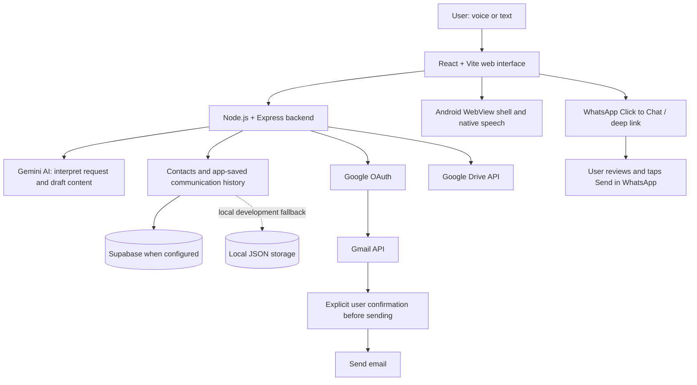

# VoiceMail Architecture

This diagram is a high-level view of the documented project design. Actual availability depends on environment configuration and provider permissions.

## Main Components

- **Frontend:** React + Vite provides the user interface and communication workflow.
- **Backend:** Node.js + Express handles server-side requests and provider integrations.
- **AI:** Gemini can assist with understanding requests and drafting or revising messages.
- **Gmail:** Google OAuth and Gmail API support authorized email sending.
- **Google Drive:** Supports the configured file-upload workflow.
- **Persistence:** Supabase can store application data when configured; local JSON fallback is intended for development, not durable multi-instance production storage.
- **Android:** A Java/WebView shell provides a mobile interface and native speech integration.
- **WhatsApp:** The app prepares a message and opens WhatsApp; the user performs the final send action.

## Trust Boundaries

1. Treat user input, AI output, saved messages, and uploaded files as untrusted.
2. Enforce authentication and authorization on the server, not only in the UI.
3. AI-generated content must not independently authorize an external action.
4. Verify the recipient and obtain explicit approval before email sending.
5. Keep secrets and tokens out of client bundles and logs.

This diagram documents intended responsibilities; it does not replace a code review or security test.
