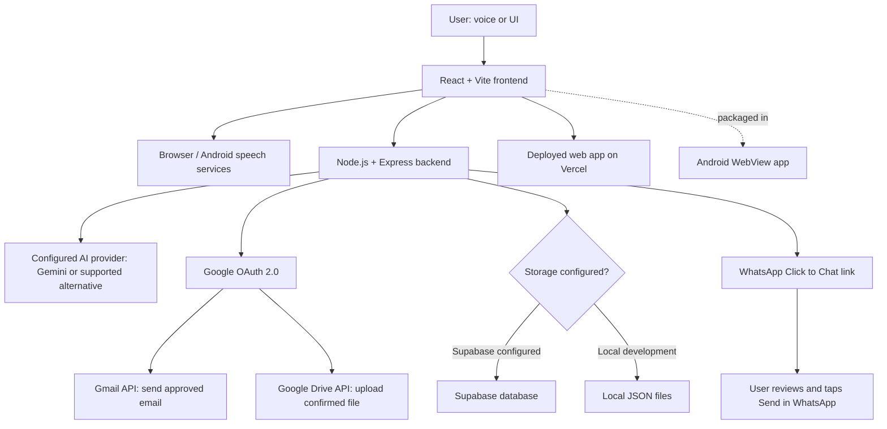

# Voice Mail Assistant 🎙️📧

**A voice-first AI productivity assistant for email, WhatsApp messaging, contact management, and Google Drive uploads — available on the web and Android.**

[](https://voicemail-mu.vercel.app/)
[](https://react.dev/)
[](https://expressjs.com/)
[](https://developer.android.com/)

## What does this app do?

Voice Mail Assistant is a voice-first AI productivity app that helps users handle everyday communication with fewer manual steps:

- **Draft emails with AI:** describe what you want to say, review the generated email, and confirm before it is sent through Gmail.
- **Use voice commands:** speak naturally to interact with the assistant on supported browsers and Android devices.
- **Manage contacts:** look up and save contact details to make repeat communication easier.
- **Prepare WhatsApp messages:** provide a recipient and message, then open WhatsApp with the text prefilled; the user reviews and taps **Send**.
- **Upload files to Google Drive:** use the supported upload workflow and confirm before uploading.
- **Use it on web or Android:** access the deployed web app or build the Android app from the included project.

In short, the app brings AI-assisted email writing, voice interaction, contact management, and messaging/file integrations into one place, while keeping the user in control of actions such as sending or uploading.

> **Project status:** The web application is deployed and an Android APK can be built from the included Android project. Check the live demo for the current deployed feature set.


## Contents

- [Why this project?](#why-this-project)
- [Features](#features)
- [Technology stack: what and why](#technology-stack-what-and-why)
- [Tools and external services](#tools-and-external-services)
- [How we built it](#how-we-built-it)
- [How it works](#how-it-works)
- [Architecture flow diagram](#architecture-flow-diagram)
- [Setup and run locally](#setup-and-run-locally)
- [Google Cloud and OAuth setup](#google-cloud-and-oauth-setup)
- [Optional Supabase setup](#optional-supabase-setup)
- [Android build](#android-build)
- [Security, limitations, and transparency](#security-limitations-and-transparency)
- [Future improvements](#future-improvements)

## Why this project?

Email and messaging are routine tasks, but writing a clear email, finding a contact, switching applications, and managing files can interrupt a user's workflow. Voice Mail Assistant explores a more natural interface: tell the assistant what you want to do, review what it prepares, and confirm before actions that affect other people.

## Features

- **Voice-first conversation:** interact with the assistant by speaking; the app supports an ongoing conversation while it is open.
- **AI-assisted email drafting:** describe the purpose and details in natural language and generate an email draft, typically around 200 words.
- **Recipient confirmation:** resolve or collect contact details and confirm the email address before sending.
- **Review before sending:** the assistant reads the draft and requires explicit final confirmation before sending through Gmail.
- **Contact management and email history:** use saved contacts and past messages sent through the app to support follow-up suggestions.
- **WhatsApp message preparation:** request a message by voice, confirm the recipient and content, then open WhatsApp with the message prefilled. The user taps **Send** in WhatsApp.
- **Google Drive upload:** request supported project files to be uploaded to a dedicated Voice Mail Assistant folder after confirmation.
- **Web and Android:** use the web interface or build the Android WebView shell with native speech support.
- **Optional Supabase persistence:** store contacts, email history, WhatsApp contacts, and Google tokens in a hosted database instead of local JSON files.

## Technology stack: what and why

The stack below describes the technologies used in the repository and the role each plays.

| Layer | Technology | Why it is used |
|---|---|---|
| Frontend | **React** | Builds the interactive interface and manages application UI state and conversation screens. |
| Frontend tooling | **Vite** | Provides the frontend development server and production build pipeline. |
| Backend runtime | **Node.js** | Runs the server-side JavaScript and integration logic. |
| Backend framework | **Express** | Exposes API routes, handles requests, and connects the frontend to AI, storage, and Google services. |
| AI email generation | **Google Gemini API** | Generates email drafts from the user's instructions and supports AI-assisted drafting. Availability and rate limits depend on the selected Gemini plan/model. |
| Additional LLM provider | **Groq API, if configured in the deployment** | Can provide an alternative LLM endpoint for supported language-model tasks. Configure the provider actually enabled in your environment; do not commit API keys. |
| Email delivery | **Gmail API** | Sends approved email drafts through the user's authorized Google account. |
| File integration | **Google Drive API** | Uploads supported files to a Drive folder after the user confirms the action. |
| Authentication and authorization | **Google OAuth 2.0** | Lets the user authorize Gmail and Drive permissions without sharing their Google password with the app. |
| Optional database | **Supabase** | Provides hosted persistence for contacts, email history, WhatsApp contacts, and Google tokens. It is optional for local development; on serverless deployments, persistent storage is recommended/required by this app's configuration. |
| Local fallback storage | **JSON files** | Stores contacts and sent-email history during local use when Supabase is not configured. Local files may not persist on ephemeral/serverless hosts. |
| Speech input/output | **Browser Web Speech APIs and Android speech/text-to-speech facilities** | Enables spoken commands, speech recognition, and spoken responses where supported by the device/browser. Availability varies by platform and network. |
| Android app shell | **Android Studio, Java, WebView** | Packages the web experience as an Android app and provides native speech-related integration. |
| Messaging handoff | **WhatsApp Click to Chat / deep link** | Opens a WhatsApp conversation with a prefilled message without requiring a paid WhatsApp Business messaging API. The user sends the message manually. |

> **Configuration note:** This project can support optional integrations through environment variables. The exact provider active in a particular deployment depends on its configuration. Only list Groq or any other provider as an active runtime dependency if its key and code path are actually enabled in that deployment.


## Tools and external services

### Google ecosystem

Google services are a significant part of the application's integration layer:

- **Google Cloud Console:** used to create/configure a cloud project, enable APIs, configure OAuth consent, register OAuth credentials, and define redirect URLs.
- **Gmail API:** sends email only after the user has reviewed the draft and confirmed sending.
- **Google Drive API:** enables the confirmed upload workflow for supported files.
- **Google OAuth 2.0:** grants scoped access to the user's Google account; the app requests the permissions required for the features being used.
- **Google Gemini API / AI Studio:** provides an API key for AI-assisted email drafting when Gemini is the configured model provider.
- **Google speech/text-to-speech options:** compatible browser or Android speech engines may be used for speech recognition and spoken responses, depending on device support and installed voices.

These integrations make the Google platform important to the application's authentication, communication, file-upload, and AI workflows. **Voice Mail Assistant is an independent project; Google services are integrations, not evidence of Google sponsorship, endorsement, or partnership.**

### Other development and deployment tools

- **Git:** tracks source-code changes and supports branching and collaboration.
- **GitHub:** hosts the repository and provides version history, issue tracking, and a public project page.
- **Vercel:** hosts the deployed web application at [voicemail-mu.vercel.app](https://voicemail-mu.vercel.app/).
- **Supabase:** optional hosted database for persistent application data.
- **Node Package Manager (npm):** installs JavaScript dependencies and runs project scripts.
- **Android Studio and Android SDK:** build, install, and test the Android package.
- **Groq (optional/configuration-dependent):** can be used as an LLM API provider where the application's provider configuration supports it. The deployment's environment variables determine whether it is active.

## How we built it

1. **Defined the communication workflow.** The application was organized around natural-language requests such as drafting an email, contacting a saved person, or preparing a WhatsApp message.
2. **Built the web interface.** React components and Vite provide the user interface and frontend build process.
3. **Added the server-side layer.** Node.js and Express handle application API routes and keep external service credentials on the server rather than exposing them in browser code.
4. **Connected AI drafting.** The backend sends the user's instructions to the configured model provider to generate an email draft. The user can review and request changes.
5. **Integrated Google Cloud services.** A Google Cloud project is configured for OAuth credentials and the Gmail API; the Drive API is enabled when Drive uploads are needed. OAuth scopes limit what the app can request access to.
6. **Implemented persistence.** Contacts and email history can use local JSON storage for local development or Supabase for hosted persistence. Supabase schema setup is provided in `supabase/schema.sql`.
7. **Added the voice interaction layer.** Speech recognition turns spoken requests into text, and speech synthesis/native speech support reads responses aloud. Support depends on the browser/device.
8. **Added WhatsApp handoff.** After the app confirms the phone number and message, it opens WhatsApp with the message prefilled. The user reviews it and taps Send.
9. **Packaged for Android.** The `android/` project wraps the web application in a WebView and can be built as an APK using Android Studio.
10. **Deployed and version-controlled the project.** Git tracks changes, GitHub hosts the source, and Vercel serves the web deployment. Deployment environment variables and OAuth redirect URLs must match the deployed domain.

## How it works


### Email workflow

1. The user starts the assistant and asks to write an email.
2. The assistant checks whether the recipient is already saved.
3. If necessary, the user provides a name and email address; the app confirms the address before proceeding.
4. The user describes the email's purpose, context, requested action, and tone in natural language.
5. The backend calls the configured AI model to draft the subject and body.
6. The assistant reads the draft and lets the user request changes.
7. The user gives explicit final approval.
8. The backend uses Google OAuth credentials and the Gmail API to send the approved email.
9. Contact information and sent-email history are saved in the configured storage, allowing relevant future suggestions from emails sent through this app.

### WhatsApp workflow

1. The user asks the assistant to message someone on WhatsApp.
2. The app looks up a saved WhatsApp contact or asks for a phone number.
3. The assistant confirms the number and message.
4. After the user agrees, the app opens WhatsApp with the message filled in.
5. The user checks the chat and taps **Send** in WhatsApp. The app does not automatically press Send.

### Google Drive workflow

1. The user asks to upload a supported file.
2. The app identifies the file and requests confirmation.
3. The user authorizes Google access through OAuth if it has not already been granted.
4. The backend uploads the supported file using the Google Drive API and the granted scope.
5. The assistant reports the result. The configured upload directory and deployment environment determine which files are available.

## Voice interaction details

- **Wake phrase:** say “Hey my assistant” or “Hey assistant” while the app is open. The wake phrase is not a background always-listening service; keep the app open for voice interaction.
- **Hands-free conversation:** after activation, the assistant can continue the conversation without requiring Start/Stop taps, depending on browser/device speech support.
- **Spoken email addresses:** `frontend/src/emailNormalize.js` normalizes spoken address patterns such as “john dot doe at gmail dot com” into `john.doe@gmail.com` before the address is used.
- **Recipient verification:** the assistant reads the recognized email address back and asks the user to confirm it. The user can correct a misheard address.
- **Draft review and send safety:** the assistant reads the draft and requires explicit confirmation before sending. Do not remove these confirmation steps when extending the workflow.
- **Interruptions:** voice interruption is enabled by default in the documented implementation. Headphones can help prevent the assistant's own speech from being picked up by the microphone.
- **Voice quality:** spoken output uses available browser or Android text-to-speech voices. Voice quality and recognition behavior vary by device, browser, installed voices, and network connection.

## Contacts and email history

- When starting an email workflow, the assistant checks whether the recipient is already saved.
- For a new contact, provide their name and email address; the app can ask whether to save the contact or use it only for the current message.
- Without Supabase, local development stores contacts and sent-email history in `backend/data/contacts.json` and `backend/data/email-history.json` when those files are used by the current configuration.
- With Supabase configured, the application can persist contacts, email history, WhatsApp contacts, and Google tokens in the hosted database. Use the schema in `supabase/schema.sql`.
- Past-email suggestions are based on the app's own saved email history; they do not automatically import the user's entire Gmail inbox.
- Back up local JSON data if you rely on it. Use a persistent database for deployments where local files may be ephemeral or read-only.

## Google Drive upload notes

To try the voice-driven upload flow, say something like: **“Hey my assistant, upload report.txt to my Google Drive.”** The assistant identifies the requested file and asks for confirmation before uploading.

- Enable the **Google Drive API** in the Google Cloud project and add the `drive.file` OAuth scope before reconnecting Google.
- The documented local workflow uploads supported files from the configured project/upload directory. Check `UPLOAD_DIR` in `backend/.env` for the current setting.
- The project documentation lists supported file types such as `.txt`, `.md`, `.csv`, `.pdf`, `.docx`, `.xlsx`, `.png`, and `.jpg`, with a documented maximum size of 25 MB. Verify these limits against the deployed version before relying on them.
- On Vercel, the filesystem is not a general-purpose persistent upload directory. Only files included with the deployment may be available to that implementation; check the current deployment configuration.
- The `drive.file` scope is limited and does not grant unrestricted access to every file in the user's Google Drive.

## WhatsApp contact and message details

Say something like: **“Hey my assistant, message Rahul on WhatsApp that I'll be late.”**

1. The app checks for a saved WhatsApp contact.
2. If the contact is not saved, the assistant asks for a phone number and confirms the number before saving it.
3. The assistant reads or confirms the message and asks whether it should open WhatsApp.
4. After the user says yes, WhatsApp opens with the chat and message prefilled.
5. The user reviews the content and taps **Send** in WhatsApp.

- This uses a WhatsApp Click to Chat/deep-link handoff; it does not send the message automatically and does not require a WhatsApp Business API key.
- The phone number must include the correct country code. The documented default country code is configurable through `DEFAULT_COUNTRY_CODE` (for example, `91` for India).
- WhatsApp must be installed on the phone; on desktop, the link may open WhatsApp Web.
- If using Supabase, ensure the database schema includes the `whatsapp_contacts` table.

## Troubleshooting and known limits

- The wake phrase works while the app is open; it is not intended to be a background wake-word service.
- If Google OAuth is still in **Testing** mode, test-user restrictions and periodic reauthorization may apply.
- Gemini and other AI providers can have free-tier rate limits; the available model is controlled by the backend configuration.
- Android speech recognition may require internet access and may produce system sounds between listening sessions.
- If browser recognition reports network errors, check connectivity and microphone permissions.
- After changing frontend source code, run `npm install` and `npm run build` inside `frontend/` before restarting the backend that serves `frontend/dist`.
- On Windows, a shorter project path can help avoid path-length issues during dependency installation.
- Before deployment, verify the environment variable names against `backend/.env.example` and the active deployment configuration.

## Deploying and rebuilding the Android app

For a deployed web backend:

1. Push the current project to GitHub and deploy it using the hosting provider's project settings or supported CLI.
2. Add the required AI, Google OAuth, and database environment variables in the hosting dashboard.
3. Add the production OAuth callback URL to the Google OAuth client and set `GOOGLE_REDIRECT_URI` to the same URL.
4. If the app is hosted on Vercel, configure persistent storage such as Supabase where required by the serverless environment.
5. Set the deployed website URL in the Android project configuration (documented as `APP_URL` in `android/gradle.properties`), then rebuild and test the APK.

Free plans, quotas, cold starts, OAuth verification, and provider policies can change. Check current provider documentation before describing any service as unlimited or guaranteed free.

## Architecture flow diagram



### Request lifecycle at a glance

```text
User speaks/types
       ↓
Frontend captures the request
       ↓
Backend determines the requested workflow
       ↓
AI drafting or service integration, as appropriate
       ↓
User reviews details and confirms the action
       ↓
Gmail API sends email / Drive API uploads file /
WhatsApp opens with a prefilled message
       ↓
Result is shown or spoken to the user
```

## Setup and run locally

### Prerequisites

- Node.js 18 or newer and npm
- Git
- A modern browser with microphone permission for voice features
- Google Cloud credentials for Gmail/Drive features
- An AI provider API key for AI drafting
- A Supabase project only if you want hosted persistence

### 1. Clone the repository

```bash
git clone https://github.com/SRUJANX1326/VoiceMail.git
cd VoiceMail
```

### 2. Build the frontend

```bash
cd frontend
npm install
npm run build
```

### 3. Configure and start the backend

```bash
cd ../backend
npm install
```

Create `backend/.env` from the supplied example file (PowerShell on Windows):

```powershell
Copy-Item .env.example .env
```

Set the environment variables required by your selected integrations. Typical variables include:

```env
GEMINI_API_KEY=your_gemini_api_key
GOOGLE_CLIENT_ID=your_google_oauth_client_id
GOOGLE_CLIENT_SECRET=your_google_oauth_client_secret
GOOGLE_REDIRECT_URI=http://localhost:3000/auth/callback
APP_URL=http://localhost:3000
DEFAULT_COUNTRY_CODE=91
# Optional persistent storage
SUPABASE_URL=
SUPABASE_KEY=
```

Use the actual variable names expected by the current backend code and `.env.example`. Do not commit your `.env` file.

Start the server:

```bash
npm start
```

Open [http://localhost:3000](http://localhost:3000). Connect Google and grant the requested permissions for Gmail/Drive features. Allow microphone access to try voice interaction.

## Google Cloud and OAuth setup

Google integrations are configured through a Google Cloud project and OAuth consent:

1. Open the [Google Cloud Console](https://console.cloud.google.com/) and create or select a project.
2. In **APIs & Services → Library**, enable the **Gmail API**. Enable the **Google Drive API** if you use file uploads.
3. Configure the OAuth consent screen / Google Auth Platform with the app name and contact information.
4. Add only the scopes needed by the features you use. The repository documentation references Gmail sending (`https://www.googleapis.com/auth/gmail.send`) and Drive file access (`https://www.googleapis.com/auth/drive.file`).
5. Create an OAuth client ID for a web application and add the correct redirect URI, such as `http://localhost:3000/auth/callback` for local development.
6. Put the client ID, client secret, and redirect URI in the backend environment variables.
7. Restart the backend and use **Connect Google** in the app. Sign in and review the consent screen.
8. For production, add the deployed callback URL to the OAuth client configuration and set the matching environment variables in the hosting provider.

**Important:** an OAuth app left in Google's Testing state may require reauthorization periodically and may restrict which accounts can use it. Production use may require additional OAuth verification depending on scopes and audience. Review Google's current policies before public release.

## Optional Supabase setup

Supabase provides persistent storage for contacts, sent-email history, WhatsApp contacts, and Google tokens when configured.

1. Create a project at [Supabase](https://supabase.com/).
2. Open the SQL Editor and run the schema in `supabase/schema.sql`.
3. Set `SUPABASE_URL` and the appropriate secret key in `backend/.env`.
4. Restart the backend and verify its health/status endpoint and logs.
5. Never expose a Supabase secret/service-role key in frontend code or commit it to Git.

Without Supabase, local development can use JSON files under `backend/data/`. Do not rely on local filesystem persistence on serverless hosting unless the host explicitly supports it.

## Android build

1. Open the `android/` folder in Android Studio.
2. Set `APP_URL` in the Android configuration (`android/gradle.properties`, as documented by the project) to the deployed site URL, without a trailing slash.
3. Sync Gradle and wait for dependencies to finish downloading.
4. Build the APK using **Build → Build Bundle(s) / APK(s) → Build APK(s)**.
5. Install the APK on a test device and grant microphone permission when prompted.
6. Test Google sign-in, voice interaction, and the workflows supported by the deployed backend.

For local testing against a development server, follow the Android notes in the repository README, including the `adb reverse` configuration where applicable.

## Deployment notes

- **Web:** the public deployment is [voicemail-mu.vercel.app](https://voicemail-mu.vercel.app/).
- **Vercel environment:** configure the required AI, Google OAuth, and Supabase variables in project settings. Set the production OAuth redirect URI to the deployed callback URL.
- **Persistent data:** serverless environments generally have ephemeral/read-only local filesystems; use Supabase or another supported persistent database for hosted data.
- **Android:** update the app's configured URL whenever the production deployment changes, then rebuild the APK if needed.

## Security, limitations, and transparency

- The app requires explicit user confirmation before sending email and before opening a WhatsApp message for review.
- WhatsApp messaging uses a handoff link; the user must tap Send in WhatsApp.
- Google access is granted through OAuth and requested scopes. Do not ask users for or store their Google password.
- Keep API keys, OAuth client secrets, database secrets, and tokens on the server. Do not commit secrets or real contact data.
- Speech recognition and text-to-speech availability vary by browser, Android device, installed voices, and network connection.
- AI services can have usage limits, model availability changes, and provider-specific terms. Free-tier availability is not a guarantee of unlimited use.
- Past-email suggestions use the app's own saved history; they do not imply that the app imports the user's entire Gmail inbox.
- Google, Gmail, Google Drive, Gemini, Android, WhatsApp, Supabase, Vercel, and Groq are trademarks or services of their respective owners. Their mention describes technical integrations only. **This project is not sponsored, endorsed, or officially affiliated with Google or any other provider.**

## Future improvements

- Improve contact management and validation across email and WhatsApp workflows.
- Add more automated tests for end-to-end voice interactions and integration failures.
- Add screenshots, an architecture image, and a short demo video to this README.
- Improve onboarding, error messages, and accessibility across desktop and Android.
- Document deployment-specific environment variables and production OAuth verification requirements.

## Repository structure

```text
VoiceMail/
├── android/       # Android Studio project / WebView shell
├── api/           # Deployment API routes
├── backend/       # Express server, AI and external service integrations
├── frontend/      # React + Vite user interface
├── supabase/      # Database schema for optional hosted persistence
├── README.md
└── vercel.json    # Vercel deployment configuration
```

## Author

**Srujan** — [GitHub: @SRUJANX1326](https://github.com/SRUJANX1326)
             [Vercel Deployment: (https://voicemail-mu.vercel.app)]


If you find the project useful, consider starring the repository, opening an issue with feedback, or suggesting an improvement.
